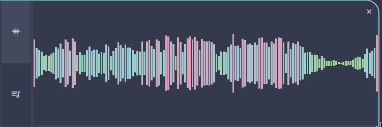

# OmaTUNES User Manual

This is the full reference for OmaTUNES — where everything lives, how to do the things you'll want to do day-to-day, and the technical details for when you want to dig deeper (database layout, theming internals, Waybar styling).

If you just want to get playing, the short version is: point `music_dir` in your config at your music folder, launch the app, and everything else in here is here when you need it.

**Contents**
1. [Player Controls & Album Art](#player-controls--album-art)
2. [Resizing the Player Section](#resizing-the-player-section)
3. [Visualizer](#visualizer)
4. [Live Lyrics](#live-lyrics)
5. [Listening Statistics & Leaderboards](#listening-statistics--leaderboards)
6. [Sidebar & Search](#sidebar--search)
7. [Library View & Track Table](#library-view--track-table)
8. [The Song Menu](#the-song-menu)
9. [Now Playing / Up Next Queue](#now-playing--up-next-queue)
10. [ID3 Tag Editor](#id3-tag-editor)
11. [Lyrics Tab in the Tag Editor](#lyrics-tab-in-the-tag-editor)
12. [Online Lookup Helpers](#online-lookup-helpers)
13. [Playlists & Smart Playlists](#playlists--smart-playlists)
14. [Theming](#theming)
15. [Waybar Integration](#waybar-integration)
16. [Keybinding Reference](#keybinding-reference)

---

## Player Controls & Album Art

<p align="center">
  
</p>

The player sits across the top of the window and handles everything about what's currently playing.

**Playback**
- **Play/Pause** — `Space`
- **Previous / Next track** — `p` / `n`
- **Seek** — click anywhere on the progress bar to jump there, or use `←`/`→` to nudge by the configured seek step (5 seconds by default)
- **Volume** — drag the slider, scroll anywhere over the player panel, or use `+`/`=` and `-` (5% steps by default)
- **Shuffle** (`s`) and **Repeat** (`r`) — both light up in your theme's accent color when active

**Add to Playlist button** — next to the Like heart, this button opens the [Song Menu](#the-song-menu) for whatever's currently playing, so you can add it to a playlist, create a new playlist from it, or remove it from the playlist you're viewing — all without leaving the player.

**Album art** — pulled from the track's embedded artwork first, falling back to a `cover.jpg`/`folder.png` sitting next to the file if there's no embedded art, and finally to a simple placeholder if neither exists. Click the artwork to jump back to the currently playing track's view.

When nothing's loaded yet, the timeline just sits empty and the Like button disappears — hit play or double-click any track to get going.

---

## Resizing the Player Section

The player section can be dragged taller if you want a bigger album art view. Grab the line just below the player controls (above the tab row) and drag it down — the album art scales up to fill the extra space, and everything else (track title, artist, controls) shifts right to make room, keeping its size and layout the same. Drag back up to shrink it again; it won't go any smaller than the default layout. Your chosen height is remembered the next time you open the app.

---

## Visualizer

<p align="center">
  
</p>

A real-time audio spectrum analyzer lives in the slide-out drawer on the right — 64 frequency bands computed live from the decoded audio, colored with a gradient that shifts as the amplitude moves.

Click the waveform tab on the right edge of the window to open it, click it again (or hit `Escape`) to close it. Drag the divider between the drawer and the library to resize it — it won't go narrower than about 450px, since much below that the visualizer and lyrics text stop having room to breathe. If your window gets too narrow overall (below roughly 1499px), the drawer hides itself automatically rather than cramping the rest of the UI.

---

## Live Lyrics

<p align="center">
  
</p>

The same drawer also shows lyrics, synced or plain:

- **Synced (LRC) lyrics** scroll and highlight automatically as the track plays — the current line is bold and in your accent color, the lines just before and after are a soft blend color, and everything else dims into the background.
- **Plain lyrics** (no timestamps) just show up as scrollable text.
- **Click any synced line** to jump playback straight to that moment.
- Scroll around freely to read ahead — the view snaps back to center on the active line the next time the song reaches a new timestamp.

---

## Listening Statistics & Leaderboards

OmaTUNES tracks your detailed listening history and provides aggregates and leaderboards within the right-side slide-out drawer tab (represented by the bar chart icon).

**Listening Statistics**
- **Slices of Time**: View stats aggregated dynamically across five columns: **Songs** played, **Hours** listened, **Top Genre**, and **Top Artist** — segmented chronologically by **Today**, **This Week**, **This Month**, and **All-Time**.
- **Interactive Browsing**: The Top Genre and Top Artist values render as clickable links. Clicking a genre or artist instantly takes you to your main Library view pre-filtered by that specific criteria.
- **Sizing Bounds**: The statistics table scales dynamically to fill the available drawer height and width, maintaining a clean 16px margin on all sides. The player split height is locked to a minimum floor of 330px to guarantee the table rows always have room to render cleanly.

**Leaderboards**
- Click the podium tab at the bottom of the statistics drawer to toggle the Leaderboards panel.
- Shows your **Monthly Top 5** and **All-Time Top 10** artists sorted by total minutes played, formatted as: `Artist Name — Xh Ym (N tracks)`.
- Features Gold, Silver, and Bronze highlighting for the top 3 spots to represent rankings.

---

## Sidebar & Search

The left sidebar is your way into the library: **Artists**, **Albums**, **Genres**, and **Folders** tabs, each filtering the main view accordingly. The search box at the top filters whichever list is showing, and keeps focus while you type so you're not fighting the UI mid-search.

Right-click any artist or album row for a quick menu: hide it from your browsing views entirely, add all its tracks to an existing playlist, or spin up a brand-new playlist from it on the spot.

---

## Library View & Track Table

<p align="center">
  
</p>

This is where you actually see your tracks. A few things worth knowing:

**Group by Tray** — Hover the grouping capsule in the bottom-right corner of the track list to expand the tray, allowing you to cluster tracks dynamically by **Album**, **Artist**, **Genre**, or **Year** under row headers. Clear the grouping by clicking the base icon or the active grouping option to collapse back to a flat view. Your grouping preference is remembered automatically between sessions.

**Columns** — click and drag a column header to reorder it, right where you want it. Right-click a header for the column menu, which now handles show/hide toggles only (reordering moved to drag-and-drop, since dragging is faster than hunting through a menu). Your column order and visibility choices are saved automatically.

**Liked column** — click the heart on any row to like/unlike a track on the spot. This replaced a cluster of separate per-row buttons that used to live at the end of each row — everything else (playlist actions, metadata editing) now lives in the [Song Menu](#the-song-menu) or your keyboard shortcuts, keeping the row itself clean.

**Responsive columns** — as you shrink the window, columns drop away in this order so nothing wraps awkwardly: Disc #, Plays, Date Played, Genre, Liked, Year, Album, Artist. Title, Duration, and the track number always stay put — if things get really tight, it'll strip down to just Title and Duration. This is purely visual and temporary; your actual saved column preferences aren't touched, and everything comes back once you widen the window again.

**Multi-select** — click a track, then Shift-click another to select the range between them. With multiple tracks selected, `E` opens bulk tag editing, or you can create a new playlist from the whole selection at once.

---

## The Song Menu

Right-click any track — in the Library, in a playlist, wherever — to bring up the Song Menu. The same menu also opens from the **Add to Playlist** button in the player controls, targeting whatever's currently playing.

- **Play Next** — queues it up immediately after the current track
- **Add to Queue** — adds it to the end of Up Next
- **Like / Unlike this song**
- **Edit ID3 tag** — opens the [tag editor](#id3-tag-editor) for this track
- **Open local file folder** — opens your file manager at the track's location
- **Add to Playlist** — click to expand a dropdown listing your playlists (with a `+` next to each), plus a "Create playlist with this song" option at the bottom — collapsed by default so this doesn't turn into a wall of playlist names as your collection grows
- **Remove from current playlist** — only shows up when you're viewing a User Playlist and the track is actually in it, so you'll never see this option somewhere it wouldn't make sense (Smart Playlists and Auto Playlists don't have a manual membership to remove from — see [Playlists & Smart Playlists](#playlists--smart-playlists) for why)

---

## Now Playing / Up Next Queue

Click the **Now Playing** tab (in the same row as Artists/Albums/Genres) to see what's queued up next. Click it again, or click anywhere outside it, to dismiss.

- **Drag to reorder** — grab the handle on the left of any row and drag it to a new position. This is the only way to reorder the queue now; the separate up/down nudge buttons and the per-row remove ✕ that used to sit at the end of each row have been retired, since dragging covers both jobs more directly. To remove a track from the queue, use the Song Menu.
- **Search the queue** — filter Up Next by keyword without disturbing playback.
- **Clear Queue** — empties everything queued up ahead of the current track.
- **Shuffle-aware** — turning shuffle on physically reorders the queue (keeping the current track in place) so what you see is exactly what's coming next, not a hidden internal order.

---

## ID3 Tag Editor

Edit metadata one track at a time, or in bulk across a whole selection.

Every field (Title, Artist, Album, Genre, Track #, Disc #, Year, Cover Path, Lyrics) has its own checkbox — start typing in a field and its box checks itself automatically. Only checked fields get written when you save, so bulk-editing a stack of tracks won't accidentally overwrite something like the Title field across all of them.

Typing in Artist, Album, or Genre brings up autocomplete suggestions pulled from your existing library — click one to fill the field and check its box in one motion. There's also an "Apply to Entire Album" option that grabs every track in the current album and applies your checked changes across all of them.

---

## Lyrics Tab in the Tag Editor

The tag editor has its own Lyrics tab for viewing and adjusting timing, separate from the read-only display in the main lyrics drawer.

- Paste or type raw lyrics text directly, LRC timestamps and all.
- If the sync feels off, use the offset controls (`+0.5s`, `+1.0s`, `-0.5s`, `-1.0s`) to build up a shift, then hit **Apply** to shift every timestamp in the text at once. **Reset** clears the pending shift without touching your lyrics.

---

## Online Lookup Helpers

Two shortcuts in the tag editor save you a trip to the browser's address bar:

- **Search Lyrics Online** — opens [lrclib.net](https://lrclib.net) pre-filled with the current track's details, so you can grab synced lyrics and paste them straight back in.
- **Search Cover Online** — opens a Google Images search pre-filled with `{artist} {album} album art`, for grabbing cover art to drop next to your files.

---

## Playlists & Smart Playlists

Everything lives in `~/.config/omatunes/db.json`. The sidebar organizes playlists into three tabs, each with its own icon and tooltip:

1. **User Playlists** — playlists you build by hand
2. **Auto Playlists** — Liked Songs, Recently Played, Most Played
3. **Smart Playlists** — rule-based, self-updating

**Reordering** — drag playlists within the User Playlists or Smart Playlists tab to put your favorites up top. Each tab keeps its own order independently (Auto Playlists always stay in their fixed positions, since they're not user-created).

### User Playlists

- **Create one** by clicking "New Playlist" at the bottom of the sidebar, or right-click a track/artist/album and create one from there directly.
- **Rename or delete** by hovering over a playlist to reveal the pencil and trash icons.
- **Add a track** via the Song Menu's Add to Playlist dropdown.
- **Reorder the songs inside it** by dragging the handle on the left of any row — the same drag pattern used in the Up Next queue.
- **Remove a song** from it via "Remove from current playlist" in the Song Menu, which only appears when you're actually viewing that playlist and the track is genuinely in it.

### Auto Playlists

These populate themselves — no manual curation needed:
- **Liked Songs** — everything you've hearted. Songs can be dragged into a custom order here, same as a User Playlist.
- **Recently Played** — your listening history, most recent first. Since the whole point of this list is showing recency, it isn't manually reorderable — dragging it around would fight its own purpose the moment you played something new.
- **Most Played** — sorted by play count, for the same reason as above: also not manually reorderable.

### Smart Playlists

These work like iTunes smart playlists: define rules, and OmaTUNES keeps the list current automatically.

- **Create one** from the Smart Playlists tab — this opens the Rule Builder.
- **Build rules** by picking a field (Title, Artist, Album, Genre, Year, Play Count, Duration, Disc Number, Liked, Has Lyrics, Last Played), an operator (Contains, Is, Greater Than, Less Than, Within Last, Between), and a value. Artist/Album/Genre fields get autocomplete chips.
- **Rules combine with AND logic** — a track needs to satisfy every rule to make the cut.
- **Sort and limit** matches by Title, Album, Artist, Play Count, Year, or Random, and optionally cap the list at a maximum size.
- **Live Updating**, when enabled, re-checks the rules automatically as your library and listening habits change.
- **Songs can be dragged into a manual order** here too — when a new track starts matching the rules, it's added to the end of your manual order rather than wherever the sort criteria would normally place it, so your arrangement doesn't get shuffled around every time the underlying set changes.
- Right-click a Smart Playlist in the sidebar to edit its rules or delete it.

---

## Theming

Open Settings (the gear icon at the far right of the library tab row) to get to the theme editor.

- **System** — follows your active Omarchy theme live.
- **Presets** — Nord, Catppuccin Mocha, Catppuccin Latte, Dracula, Gruvbox (Dark), Everforest (Dark), Monokai.
- **Custom** — you edit 7 base colors (Background, Primary Text, Accent, Green, Red, Yellow, Blue), and OmaTUNES derives the remaining 4 supporting shades for you — a deeper background variant, a panel background, muted/secondary text — automatically calculated to hit proper WCAG contrast ratios against your base colors. That means a custom theme you build here won't quietly end up with text you can't read; the math handles it for you.

---

## Waybar Integration

OmaTUNES listens on UDP port `18888` for commands, which the Waybar script talks to.

### CSS

Drop this into `~/.config/waybar/style.css` for a clean rounded pill that collapses when omaTUNES
isn't running:

```css
#custom-omatunes {
  background-color: @theme_bg;
  border: 2px solid @active_border;
  border-radius: 50px;
  padding-left: 14px;
  padding-right: 14px;
  margin-top: 3px;
  margin-bottom: 3px;
  margin-right: 10px;
  transition: all 0.2s ease;
}

#custom-omatunes:hover {
  background-color: #414559;
}
```

### What each click/scroll does

| Input | Action |
|---|---|
| Left click | Play / Pause |
| Middle click | Like / Unlike current track |
| Right click | Next track |
| Scroll up | Volume +5% |
| Scroll down | Volume −5% |

### Notifications

The Waybar script also handles a few nice-to-haves on its own: a desktop notification at your 10th,
50th, and every 100th track of the day, and an hourly "time flies" nudge for each active listening
hour. It reads your active Alacritty/Omarchy theme colors to keep the bar and tooltip visually in
sync with the rest of your setup.

---

## Keybinding Reference

| Key | Context | Action |
|---|---|---|
| `Space` | Player | Play / Pause |
| `→` | Player | Seek forward (default 5s) |
| `←` | Player | Seek backward (default 5s) |
| `↑` / `↓` | Track List | Move track focus up/down |
| `n` / `N` | Player | Next track |
| `p` / `P` | Player | Previous track |
| `s` / `S` | Player | Toggle Shuffle |
| `r` / `R` | Player | Toggle Repeat |
| `+` or `=` | Player | Volume up (default 5%) |
| `-` | Player | Volume down (default 5%) |
| `l` / `L` / `f` / `F` | Track List | Toggle Liked for selected track |
| `e` / `E` | Track List | Open tag editor for selection |
| `c` / `C` | Sidebar | New Playlist dialog |
| `a` / `A` | Track List | Open Add to Playlist for selected track |
| `/` | Player | Focus and clear the track search box |
| `F5` | Player | Rescan your music library folder |
| `Tab` | Player | Cycle focus: sidebar search → sidebar list → track list → song search → back to sidebar search |
| `Enter` | Dialog / Editor | Submit / save (or double-click to play a track) |
| `Escape` | Dialog / Editor | Close whatever's open |
| `]` | Player | Increase UI font scale |
| `[` | Player | Decrease UI font scale |
